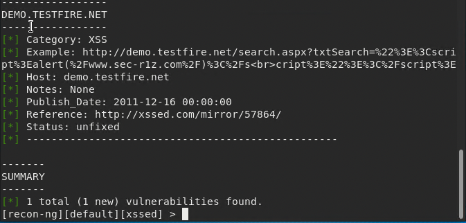

## Week 16 Homework Submission File: Penetration Testing 1

#### Step 1: Google Dorking


- Using Google, can you identify who the Chief Executive Officer of Altoro Mutual is: <br>
Yes, Karl Fitzgerald. 

- How can this information be helpful to an attacker: <br>
Knowing this information can assist in the implementation of a Spear-Phishing attack targeting the CEO.

#### Step 2: DNS and Domain Discovery

Enter the IP address for `demo.testfire.net` into Domain Dossier and answer the following questions based on the results:

  1. Where is the company located: <br>
  Sunnyvale, CA <br>
  US <br>
  94085 <br>

  2. What is the NetRange IP address: <br>
  65.61.137.61 - 65.61.137.127

  3. What is the company they use to store their infrastructure: <br>
  Rackspace Backbone Engineering

  4. What is the IP address of the DNS server: <br>
  23.211.61.64

#### Step 3: Shodan

- What open ports and running services did Shodan find: <br>

53 TCP (dns-tcp) <br>53 UDP (Multicast DNS).<br>


#### Step 4: Recon-ng

- Install the Recon module `xssed`. 
- Set the source to `demo.testfire.net`. 
- Run the module. 

Is Altoro Mutual vulnerable to XSS: <br>
Yes, the following vulnerability was observed: <br> 

<br>
### Step 5: Zenmap

Your client has asked that you help identify any vulnerabilities with their file-sharing server. Using the Metasploitable machine to act as your client's server, complete the following:

- Command for Zenmap to run a service scan against the Metasploitable machine: 
 
- Bonus command to output results into a new text file named `zenmapscan.txt`: <br>
```
nmap -A -p 1-445 -oN zenmapscan.txt 192.168.0.10
```

- Zenmap vulnerability script command: <br>
```
nmap -sV 192.168.0.10
```


- Once you have identified this vulnerability, answer the following questions for your client:
  1. What is the vulnerability: <br>
  Potential exploit indentified on the Samba service running on ports 139 and 445.

  2. Why is it dangerous: <br>
   Version 3.x of Samba is vulnerable to unauthorized access gain to file shares without authentication via SMB. Access to root file system possible via this exploit.

  3. What mitigation strategies can you recommendations for the client to protect their server: <br>
  Filtration of user input restricting SMB session connection.
  Upgrade to latest version of Samba. 

---
© 2020 Trilogy Education Services, a 2U, Inc. brand. All Rights Reserved.  

